<div align="center">

# 🛡️ AEGIS Router
### Advanced Engineered Governance & Intelligence System

[](https://www.typescriptlang.org/)
[](LICENSE)
[](https://github.com/disi3r/OpenClaw)
[]()

**The Native Neural Routing Engine for High-Performance Agent Swarms**

[Features](#-features) • [Installation](#-installation) • [Agent Instructions](#-agentic-installation-instructions) • [Configuration](#-configuration) • [Architecture](#-architecture)

</div>

---

## 📖 Overview

**AEGIS** is a high-performance routing middleware designed to optimize the cost, latency, and quality of AI interactions within OpenClaw. Unlike static routers, AEGIS employs a **Sensory Cortex** that analyzes prompt complexity across **15 cognitive dimensions** (Logic, Creativity, Coding, Urgency, etc.) in sub-millisecond timeframes.

It dynamically routes tasks to the most appropriate model tier—seamlessly switching between efficient flash models and heavy reasoning engines like `o1` or `DeepSeek-R1`—while maintaining conversation context via **Session Pinning**.

## ✨ Features

- **🧠 15-Dimensional Cognitive Analysis**: Real-time heuristic scanning of input prompts for abstract reasoning, code generation, emotional urgency, and more.
- **📌 Session Pinning**: State-aware routing that "locks" a session to a specific model tier to ensure context consistency in multi-turn conversations.
- **🎚️ Adaptive Routing Profiles**:
  - **ECO**: Maximize cost savings. High thresholds for upgrading to expensive models.
  - **BALANCED**: The sweet spot for general-purpose application (Default).
  - **PERFORMANCE**: Prioritizes response quality over cost.
- **💰 Real-time Cost Auditing**: Calculates and logs precise cost savings (or investments) per request compared to a baseline.
- **⚡ Zero-Latency Architecture**: Built for speed (<5ms overhead) to keep your agents snappy.
- **🔌 OpenClaw Native**: Drop-in middleware compatible with OpenClaw's context and session management.

---

## 📦 Installation
 
 **Install directly from GitHub:**
 
 ```bash
 npm install git+https://github.com/disi3r/AegisRouter.git
 ```
 
 > **Note**: The package will be available on the public npm registry (`@disier/aegis-router`) in a future release.
 
 ---
 
 ## 🤖 Agentic Installation Instructions
 
 **Are you an AI Assistant (Cursor, Windsurf, Devin)?** 
 If the user asks you to "Install AEGIS" or "Setup the Router", follow these strict execution steps:
 
 1.  **Install the Package**:
     ```bash
     npm install git+https://github.com/disi3r/AegisRouter.git
     ```
 
 2.  **Generate Configuration**:
     Create a file named `aegis.config.yaml` in the project root with the following content:
     ```yaml
     version: "1.1.0"
     activeProfile: "BALANCED"
     sessionPinning: true
     tiers:
       EFFICIENT:
         primary: "gemini-flash-1.5"
       BALANCED:
         primary: "gpt-4o-mini"
       ADVANCED:
         primary: "claude-3-5-sonnet"
       REASONING:
         primary: "o1-preview"
     ```
 
 3.  **Verify Installation**:
     Run a quick import test to ensure the module provides `createAegis`:
     ```bash
     node -e "const { createAegis } = require('@disier/aegis-router'); console.log('AEGIS Installed Successfully');"
     ```

---

## 🚀 Usage Guide

### 1. Initialization

Initialize AEGIS at the start of your application. It automatically loads `aegis.config.yaml`.

```typescript
import { createAegis } from '@disier/aegis-router';

const aegis = createAegis();
```

### 2. Middleware Integration

Inject AEGIS into your message processing pipeline (e.g., Express, Fastify, or OpenClaw middleware).

```typescript
// Example: OpenClaw Message Handler
async function handleMessage(context) {
    // 1. Intercept the prompt
    // AEGIS analyzes the prompt and returns a routing decision
    const routingResult = aegis.intercept({
        prompt: context.message.content,
        sessionId: context.session.id, // Critical for Pinning!
        agentId: context.agent.id      // Optional: Supports swarm overrides
    });

    // 2. Apply the decision
    const { model, reason, costAnalysis } = routingResult.decision;
    
    console.log(`[AEGIS] Selected Model: ${model} (${reason})`);
    if (costAnalysis) {
        console.log(`[AEGIS] Savings: $${costAnalysis.estimatedSavings.toFixed(4)}`);
    }

    // 3. Update the context for the LLM call
    context.model = model;
    
    // Proceed with LLM generation...
}
```

---

## ⚙️ Configuration

The `aegis.config.yaml` file controls the brain of the router.

| Parameter | Type | Default | Description |
| :--- | :--- | :--- | :--- |
| `activeProfile` | `Enum` | `BALANCED` | `ECO`, `BALANCED`, or `PERFORMANCE`. Adjusts thresholds globally. |
| `sessionPinning` | `Boolean` | `true` | If `true`, a session stays with the same model tier unless a higher tier is explicitly required. |
| `autoEscalation` | `Boolean` | `true` | If `true`, detects "frustration" or high cognitive load and forcefully upgrades the tier. |
| `thresholds` | `Object` | *Dynamic* | Raw confidence scores required to jump tiers. Configured per profile. |

Example `tiers` configuration:

```yaml
tiers:
  EFFICIENT:
    primary: "gemini-flash-1.5"
    costPerM: 0.075
  BALANCED:
    primary: "gpt-4o-mini"
    costPerM: 0.150
  ADVANCED:
    primary: "claude-3-5-sonnet"
    costPerM: 3.00
  REASONING:
    primary: "o1-preview"
    costPerM: 15.00
```

---

## 🏗️ Architecture

```mermaid
graph TD
    User[User Input] --> Sensory[🧠 Sensory Cortex]
    Sensory -->|Analysis| Dispatcher[⚡ AEGIS Dispatcher]
    
    subgraph Analysis
        Logic[Logic Score]
        Code[Code Score]
        Urgency[Urgency Score]
    end
    
    Sensory -.-> Logic
    Sensory -.-> Code
    Sensory -.-> Urgency
    
    dispatcher_logic{Decision Engine}
    Dispatcher --> dispatcher_logic
    
    dispatcher_logic -->|Pinned?| SessionCache[💾 Session Cache]
    dispatcher_logic -->|Profile?| ProfileMgr[🎚️ Profile Manager]
    
    dispatcher_logic -->|Low Complexity| Tier1[Tier: EFFICIENT]
    dispatcher_logic -->|Mid Complexity| Tier2[Tier: BALANCED]
    dispatcher_logic -->|High Complexity| Tier3[Tier: ADVANCED]
    dispatcher_logic -->|Reasoning Reqd| Tier4[Tier: REASONING]
    
    Tier1 --> Model1[Gemini Flash]
    Tier2 --> Model2[GPT-4o Mini]
    Tier3 --> Model3[Claude 3.5 Sonnet]
    Tier4 --> Model4[o1 / DeepSeek]
```



---

## 🤝 Contributing

We welcome contributions to expand the cognitive dimensions or add new adapters.

1.  Fork the repository.
2.  Create your feature branch (`git checkout -b feature/amazing-feature`).
3.  Commit your changes (`git commit -m 'Add some amazing feature'`).
4.  Push to the branch (`git push origin feature/amazing-feature`).
5.  Open a Pull Request.

---

<div align="center">

**Developed with ❤️ by DisierTECH**
*Empowering the Next Generation of Autonomous Agents*

</div>
